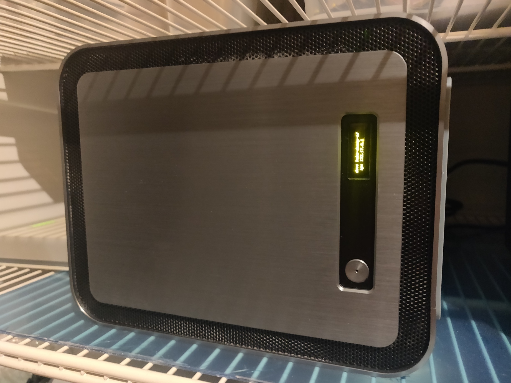
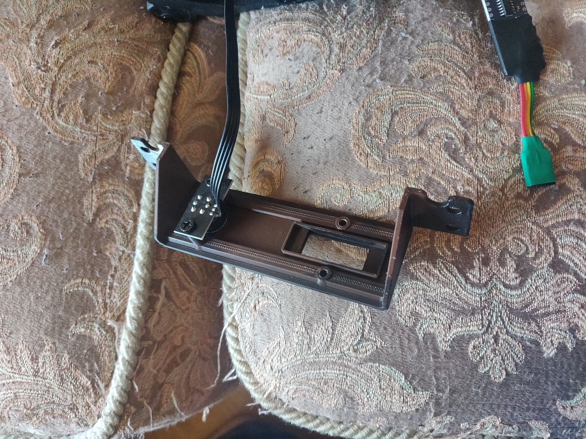
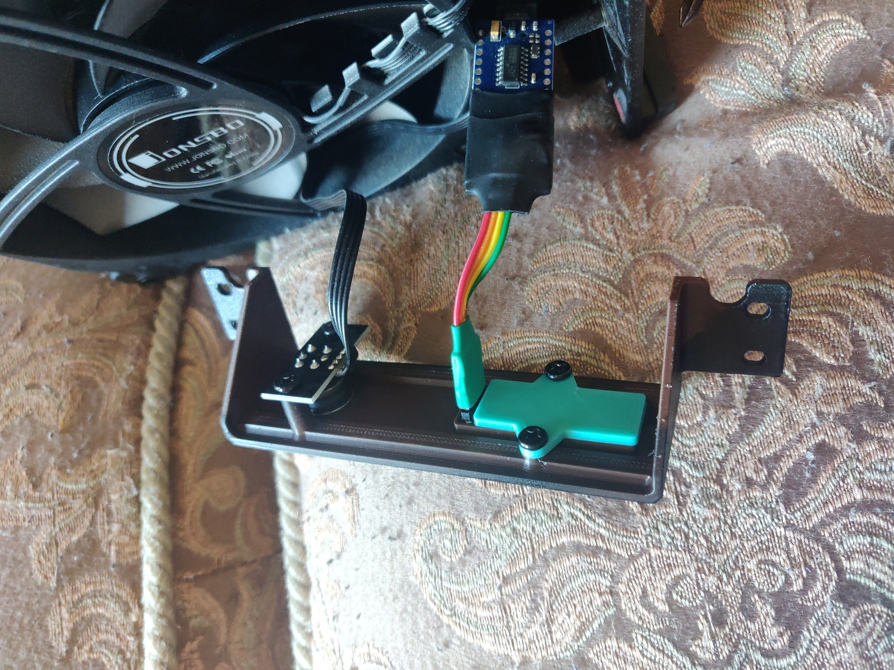
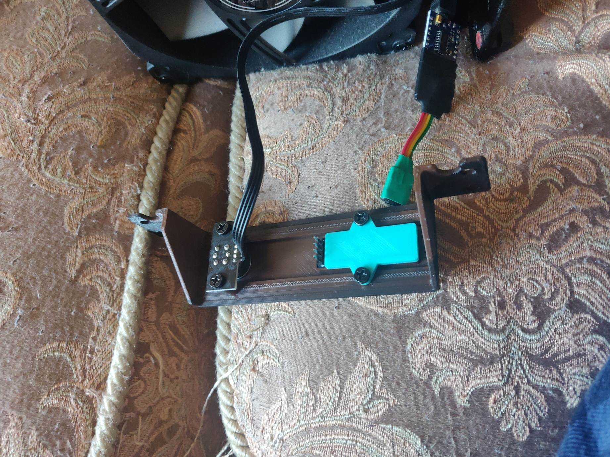
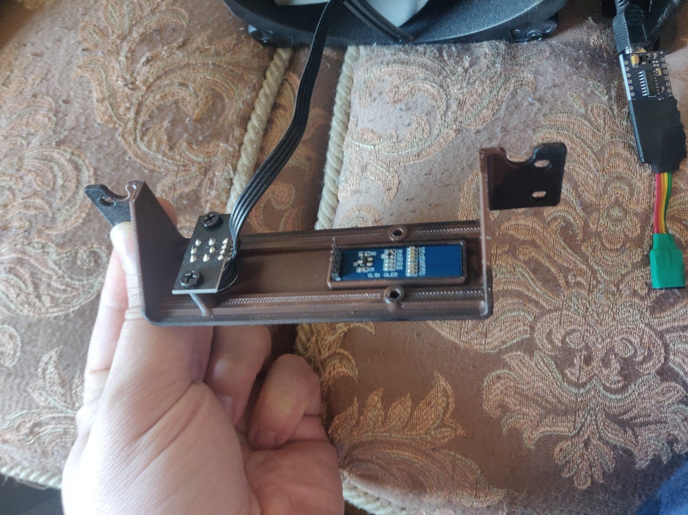

Arduino + SSD1306 for Jonsbo N1
-------------------------------

This is remix of Jonsbo N1 case front panel. I removed I/O-ports and added SSD1306 OLED display which controlled from
host-system via arduino nano and bash script.

Hardware you need
-----------------

* Jonsbo N1
* Arduino Nano (or what you have)
* SSD1306 OLED 0.91 display (128x32)

[How to wire](https://thesolaruniverse.wordpress.com/2019/10/28/how-to-wire-and-run-a-128x32-oled-display-with-ssd1306-driver-with-an-arduino/)

Build firmware
--------------

You need `platformio` to build project:

```bash
pio run
pio run -t upload
```

Images
------





