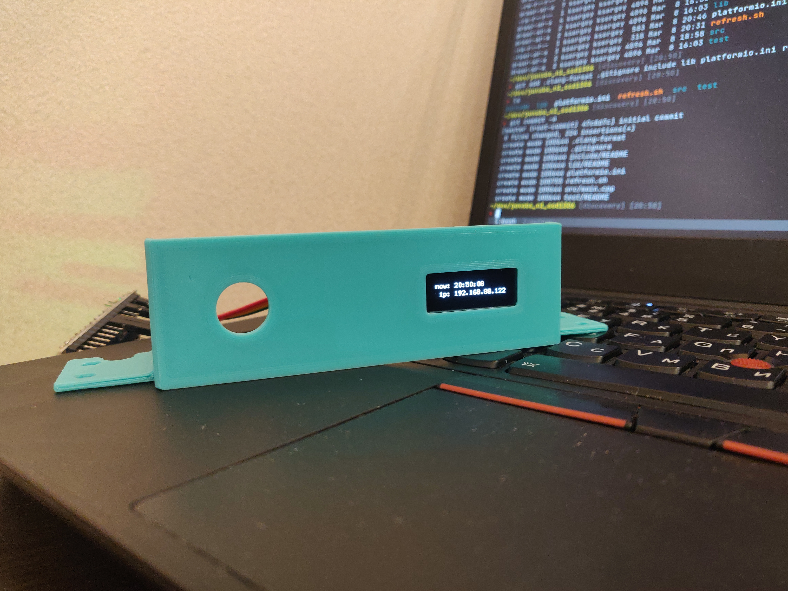

Arduino + SSD1306 for Jonsbo N1
-------------------------------

This is remix of Jonsbo N1 case front panel. I removed I/O-ports and added SSD1306 OLED display which controlled from
host-system via arduino nano and bash script.

